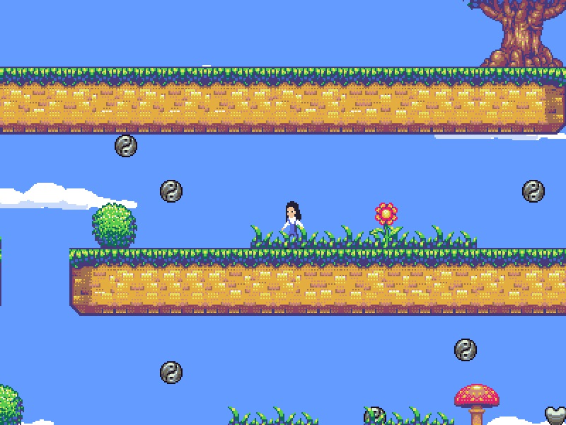

# love2d_boilerplate
The basics of a simple (platforming) game written in Love2D. Should be easy to hack and to extend into a completely different game

Features a simple component based entity system and a nice way of handling keyboard/joystick input.

Third party frameworks used:
* anim8
* bump
* hump
* sti

